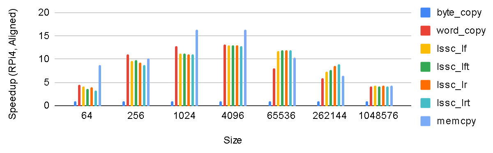
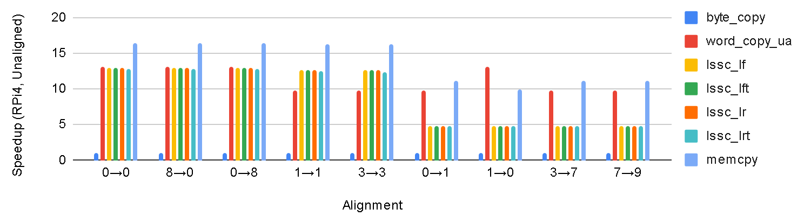
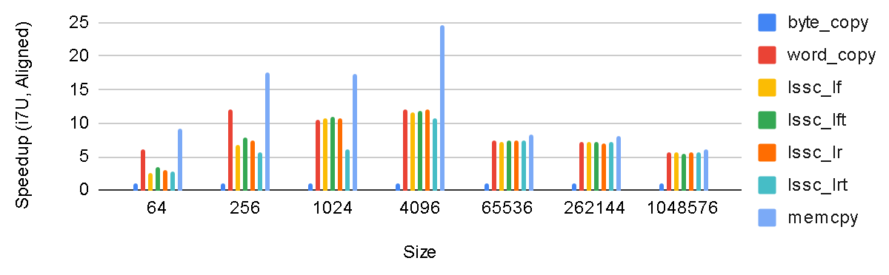
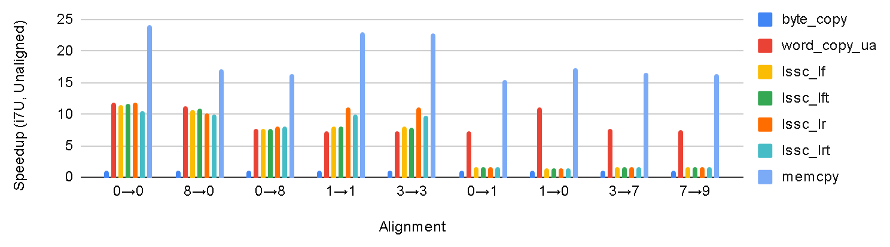
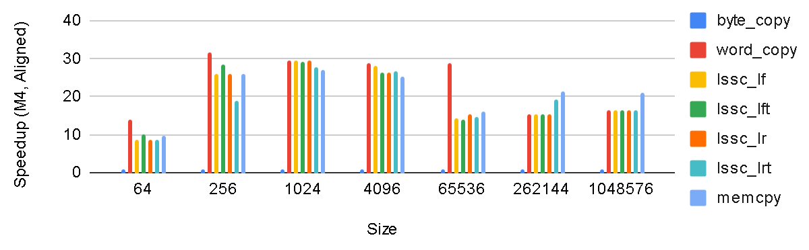
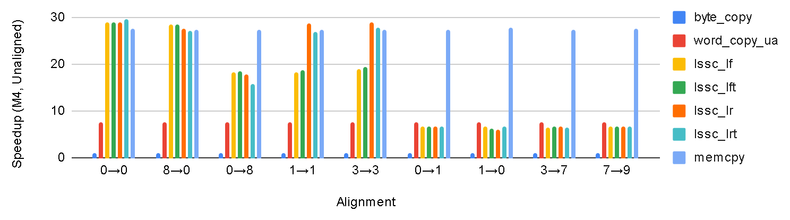

## memcpy

[](https://gitlab.com/bikkey17/memcpy/-/commits/master)

Portable `memcpy`/`memset`/`bzero` equivalents that align memory access and use
wide registers to improve throughput over byte-sized access. Rarely useful
except as baseline when you don't have optimising compilers or an MMU dealing
with alignment faults. Do your benchmarks.

If you have a working libc, or speed is not an issue, don't waste your time
here.

| Functionality | Endianness | Direction | Thread-Safe | Implemented by |
|---------------|------------|-----------|-------------|----------------|
| `memcpy`      | little     | forward   | no          | `lssc_lf`      |
| `memcpy`      | little     | forward   | yes         | `lssc_lft`     |
| `memcpy`      | little     | reverse   | no          | `lssc_lr`      |
| `memcpy`      | little     | reverse   | yes         | `lssc_lrt`     |
| `memset`      | little     | (forward) | no          | `init_lf`      |
| `memset`      | little     | (forward) | yes         | `init_lft`     |
| `bzero`       | little     | (forward) | no          | `zero_lf`      |
| `bzero`       | little     | (forward) | yes         | `zero_lft`     |
| `memcpy`      | big        | forward   | no          | TBD            |
| `memcpy`      | big        | forward   | yes         | TBD            |
| `memcpy`      | big        | reverse   | no          | TBD            |
| `memcpy`      | big        | reverse   | yes         | TBD            |
| `memset`      | big        | (forward) | no          | TBD            |
| `memset`      | big        | (forward) | yes         | TBD            |
| `bzero`       | big        | (forward) | no          | TBD            |
| `bzero`       | big        | (forward) | yes         | TBD            |

This is not a library. Build your own wrappers.

```c
void *memcpy(void * restrict dest, const void * restrict src, size_t n)
{
    lssc_lft(dest, src, n);
    return dest;
}

void *memmove(void *dest, const void *src, size_t n)
{
    if (src < dest)
        lssc_lrt(dest, src, n);
    else
        lssc_lft(dest, src, n);
    return dest;
}

void *memset(void *dest, int c, size_t n)
{
    init_lft(dest, c, n );
    return dest;
}

void bzero(void *dest, size_t n)
{
    zero_lft(dest, n );
}
```

## Build/Test

```sh
make            # build and run the unit tests (the default target)
make check      # everything CI runs
make clean
```

**Compilers**: `clang` (default), `gcc` (`make CC=gcc`)

| variable  | default | notes                                                    |
|-----------|---------|----------------------------------------------------------|
| `CC`      | `clang` | `CC=gcc` for GCC                                         |
| `OPT`     | `-O3`   | passed at start of CC command line                       |
| `OUT_DIR` | `out/`  |                                                          |
| `XFLAGS`  |         | custom CC options, passed at the end of the command line |

| target         | effect                                                    |
|----------------|-----------------------------------------------------------|
| `all`          | `test`                                                    |
| `bench`        | run a phoney benchmark                                    |
| `check`        | all `test*` targets, ~30s from clean                      |
| `clean`        | empties `OUT_DIR`                                         |
| `print.VAR`    | prints Makefile variable `VAR` (for Makefile debugging)   |
| `test`         | correctness for current CPU's `MWORD_SIZE` / `MMIN_ALIGN` |
| `test-configs` | test for other `MWORD_SIZE`/`MMIN_ALIGN` pairs            |
| `test-san`     | run UBSan                                                 |
| `test-asan`    | run ASan (stores-only) for thread-safe routines           |
| `test-mt`      | thread-safety fuzzing                                     |

The sanitizer targets need runtimes, which are separate packages on Debian:
`libasan8` and `libubsan1` for `gcc`, `libclang-rt-dev` for `clang`.

## CI

CI runs `make check` for {`x86_64`, `aarch64`} x {`gcc`, `clang`}.


## Benchmarks

All speedups are rounded to nearest integer and relative to `byte_copy` of the same row.

### RPi4, Raspberry Pi OS (64-bit), clang version 19.1.7 (3+b1)

#### Speedup (page-aligned)

| Size    | `byte_copy` | `word_copy` | `lssc_lf` | `lssc_lft` | `lssc_lr` | `lssc_lrt` | `memcpy` |
|---------|-------------|-------------|-----------|------------|-----------|------------|----------|
| 64      | 1           | 5           | 4         | 4          | 4         | 3          | 9        |
| 256     | 1           | 11          | 10        | 10         | 9         | 9          | 10       |
| 1024    | 1           | 13          | 11        | 11         | 11        | 11         | 16       |
| 4096    | 1           | 13          | 13        | 13         | 13        | 13         | 16       |
| 65536   | 1           | 8           | 12        | 12         | 12        | 12         | 10       |
| 262144  | 1           | 6           | 7         | 8          | 9         | 9          | 6        |
| 1048576 | 1           | 4           | 4         | 4          | 4         | 4          | 4        |



#### Speedup (4KB, unaligned)

| Aligment | `byte_copy` | `word_copy_ua` | `lssc_lf` | `lssc_lft` | `lssc_lr` | `lssc_lrt` | `memcpy` |
|----------|-------------|----------------|-----------|------------|-----------|------------|----------|
| 0→0      | 1           | 13             | 13        | 13         | 13        | 13         | 16       |
| 8→0      | 1           | 13             | 13        | 13         | 13        | 13         | 16       |
| 0→8      | 1           | 13             | 13        | 13         | 13        | 13         | 16       |
| 1→1      | 1           | 10             | 13        | 13         | 13        | 12         | 16       |
| 3→3      | 1           | 10             | 13        | 13         | 13        | 12         | 16       |
| 0→1      | 1           | 10             | 5         | 5          | 5         | 5          | 11       |
| 1→0      | 1           | 13             | 5         | 5          | 5         | 5          | 10       |
| 3→7      | 1           | 10             | 5         | 5          | 5         | 5          | 11       |
| 7→9      | 1           | 10             | 5         | 5          | 5         | 5          | 11       |



### i7U 155H, Linux, clang version 22.1.6 

| Size    | `word_copy` | `byte_copy` | `lssc_lf` | `lssc_lft` | `lssc_lr` | `lssc_lrt` | `memcpy` |
|---------|-------------|-------------|-----------|------------|-----------|------------|----------|
| 64      | 6           | 1           | 3         | 3          | 3         | 3          | 9        |
| 256     | 12          | 1           | 7         | 8          | 7         | 6          | 18       |
| 1024    | 10          | 1           | 11        | 11         | 11        | 6          | 17       |
| 4096    | 12          | 1           | 12        | 12         | 12        | 11         | 25       |
| 65536   | 7           | 1           | 7         | 7          | 7         | 7          | 8        |
| 262144  | 7           | 1           | 7         | 7          | 7         | 7          | 8        |
| 1048576 | 6           | 1           | 6         | 6          | 6         | 6          | 6        |




| Aligment | `byte_copy` | `word_copy_ua` | `lssc_lf` | `lssc_lft` | `lssc_lr` | `lssc_lrt` | `memcpy` |
|----------|-------------|----------------|-----------|------------|-----------|------------|----------|
| 0→0      | 1           | 12             | 11        | 12         | 12        | 10         | 24       |
| 8→0      | 1           | 11             | 11        | 11         | 10        | 10         | 17       |
| 0→8      | 1           | 8              | 8         | 8          | 8         | 8          | 16       |
| 1→1      | 1           | 7              | 8         | 8          | 11        | 10         | 23       |
| 3→3      | 1           | 7              | 8         | 8          | 11        | 10         | 23       |
| 0→1      | 1           | 7              | 2         | 2          | 2         | 2          | 15       |
| 1→0      | 1           | 11             | 2         | 2          | 2         | 2          | 17       |
| 3→7      | 1           | 8              | 2         | 2          | 2         | 2          | 17       |
| 7→9      | 1           | 8              | 2         | 2          | 2         | 2          | 16       |




### M4, Darwin, Apple clang version 17.0.0

#### Speedup (page-aligned)

| Size    | `byte_copy` | `word_copy` | `lssc_lf` | `lssc_lft` | `lssc_lr` | `lssc_lrt` | `memcpy` |
|---------|-------------|-------------|-----------|------------|-----------|------------|----------|
| 64      | 1           | 14          | 9         | 10         | 9         | 9          | 10       |
| 256     | 1           | 32          | 26        | 29         | 26        | 19         | 26       |
| 1024    | 1           | 30          | 29        | 29         | 29        | 28         | 27       |
| 4096    | 1           | 29          | 28        | 26         | 26        | 27         | 25       |
| 65536   | 1           | 29          | 14        | 14         | 15        | 15         | 16       |
| 262144  | 1           | 15          | 15        | 15         | 15        | 19         | 21       |
| 1048576 | 1           | 16          | 16        | 16         | 16        | 16         | 21       |



#### Speedup (4KB, unaligned)

| Aligment | `byte_copy` | `word_copy_ua` | `lssc_lf` | `lssc_lft` | `lssc_lr` | `lssc_lrt` | `memcpy` |
|----------|-------------|----------------|-----------|------------|-----------|------------|----------|
| 0→0      | 1           | 8              | 29        | 29         | 29        | 30         | 28       |
| 8→0      | 1           | 8              | 28        | 28         | 28        | 27         | 27       |
| 0→8      | 1           | 8              | 18        | 18         | 18        | 16         | 27       |
| 1→1      | 1           | 8              | 18        | 19         | 29        | 27         | 27       |
| 3→3      | 1           | 8              | 19        | 19         | 29        | 28         | 27       |
| 0→1      | 1           | 8              | 7         | 7          | 7         | 7          | 27       |
| 1→0      | 1           | 8              | 7         | 6          | 6         | 7          | 28       |
| 3→7      | 1           | 8              | 7         | 7          | 7         | 7          | 27       |
| 7→9      | 1           | 8              | 7         | 7          | 7         | 7          | 27       |



## Licence

MIT, see `LICENSE.txt`. `dev/unity` carries its own.
